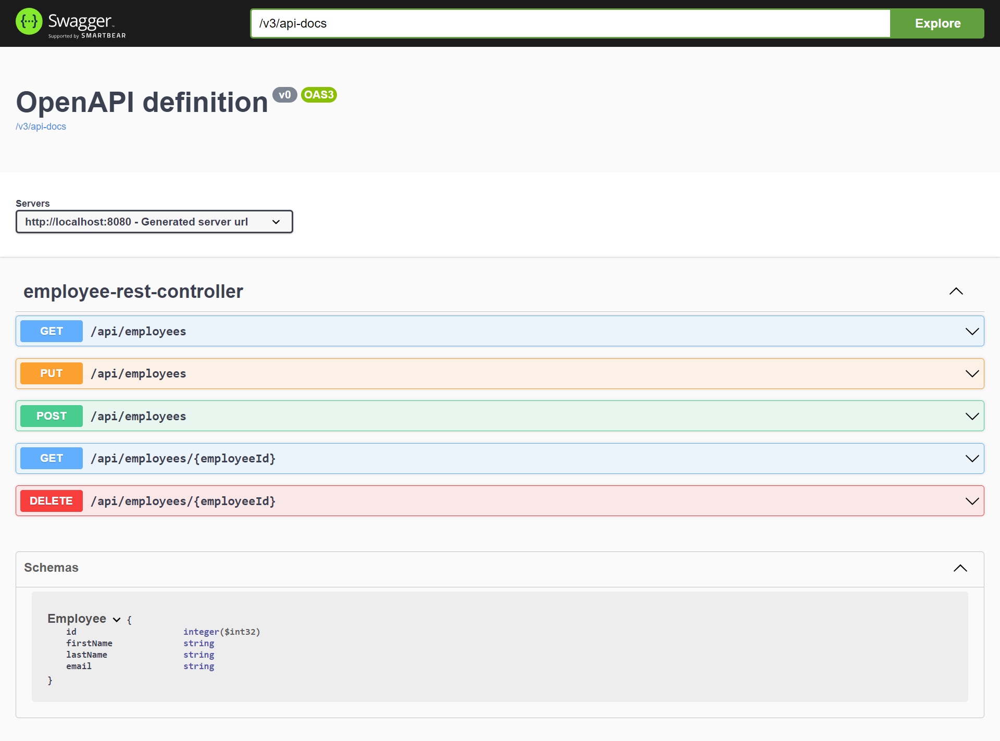

# Spring Boot Rest API with Swagger UI

Creating a rest api and document it as swagger UI.

1) add dependency into pom.xml
```
   <dependency>
   <groupId>org.springdoc</groupId>
   <artifactId>springdoc-openapi-starter-webmvc-ui</artifactId>
   <version>2.0.2</version>
   </dependency>
```
2) run 
```
    mvn spring-boot:run
```
3) go to http://localhost:8080/swagger-ui/index.html

Sample screenshot


Refer to https://medium.com/@f.s.a.kuzman/using-swagger-3-in-spring-boot-3-c11a483ea6dc by
Fady Kuzman


